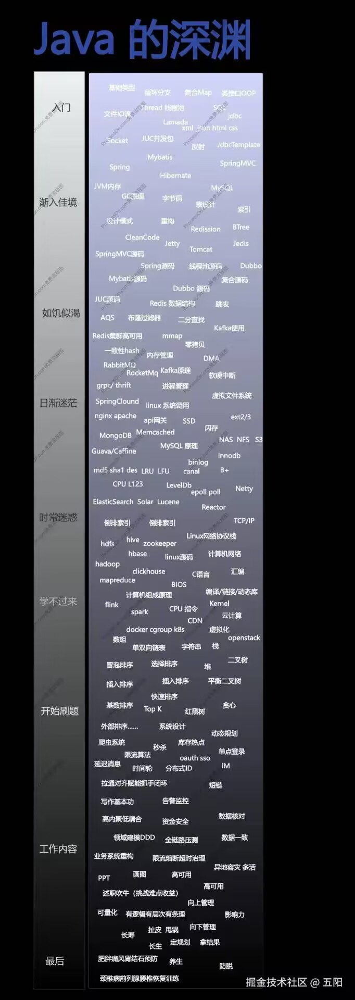

# Java 学习路线

https://www.bilibili.com/video/BV1EQE4zMEpP/?share_source=copy_web&vd_source=76548a9555af69e97f2f2fb867c8f548 【211本，4段大厂实习，优雅爷的分享】

# Java 项目

https://pan.baidu.com/s/1TM5d7i-zspcUqQ7cuZcRFg 【提取码:9999】 【黑马35个项目】

# 面试算法
https://github.com/youngyangyang04/leetcode-master 【代码随想录】

https://space.bilibili.com/206214 【我是灵茶的fans】

# Java 八股

https://www.bilibili.com/video/BV1p7RdY3EXN/?share_source=copy_web&vd_source=920f3d0fa6bab9407771f9d222fca095 【【不背八股】手写spring-framework(上) B站】 

<a href="../_media/2024年Java程序员找工作最新场景题(1).pdf" download style="color: inherit; text-decoration: none;">
  【2024年Java程序员找工作最新场景题.pdf】
</a>

<a href="../_media/Java学习攻略详解.pdf" download style="color: inherit; text-decoration: none;">
  【Java学习攻略详解】
</a>

<a href="../_media/MySQL是怎样运行的：从根儿上理解MySQL.pdf" download style="color: inherit; text-decoration: none;">
  【MySQL是怎样运行的：从根儿上理解MySQL.pdf】
</a>

<a href="../_media/数据密集型应用系统设计 (Martin Kleppmann) (Z-Library).pdf" download style="color: inherit; text-decoration: none;">
  【数据密集型应用系统设计】
</a>

<a href="../_media/高性能MySQL（第4版） (Jeremy Tinley  Silvia Botros) (Z-Library).epub" download style="color: inherit; text-decoration: none;">
  【高性能MySQL】
</a>

# Other

https://www.yuque.com/shierkcs/catstudy/zf61dnmp52c8nxtr    【Java学习笔记】

https://hardcore.feishu.cn/wiki/wikcn7FQDsq2tn2MOaZSDryv8Lf 【Timeline Feed系统设计】

https://mp.weixin.qq.com/s/GQGidprakfticYnbVYVYGQ  【当谈论协程时，我们在谈论什么】

https://mp.weixin.qq.com/s/IO4ynnKEfy2Rt-Me7EIeqg  【CompletableFuture原理与实践-外卖商家端API的异步化】

https://www.bilibili.com/opus/758312609901445367   【B站千亿级点赞系统服务架构设计】

